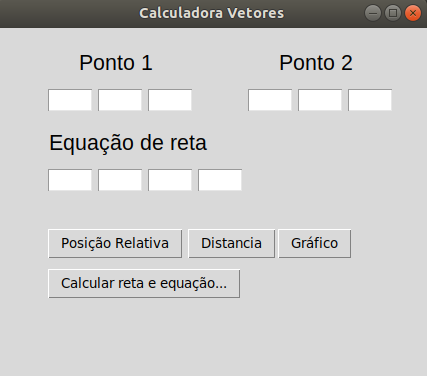
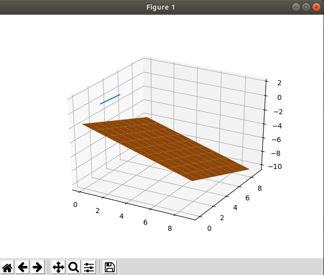

# Calculadora Geometria Analitica - Vetores 

Projeto semestral para a matéria de Geometria Analítica, disciplina cursada no Centro Universitário FEI. Cálculo e informações a partir do input de dados de um vetor.

## Funcionalidade

O programa lê os dois pontos digitados pelo usuário, bem como os valores que formam a equação do plano. A partir desses dados é possível calcular:



**1 - Reta Obtida** - Exibe a reta formada pelos dois pontos. 

**2 - Equação vetorial** - Exibe a equação vetorial da reta obtida anteriormente.

**3 - Equação da Reta** - Exibe a equação de reta formada a partir das entradas do usuário.

**4 - Vetor N** - Exibe o vetor N obtido a partir da equação de reta.

**5 - Posição relativa** - Exibe a posição relativa entre reta e plano, podendo ser transversal, paralela ou até mesmo contida.

**6 - Distância** - Informa a distância entre a reta e o plano, podendo ser nula de acordo com a posição relativa.

**7 - Gráfico de reta e plano** - Exibe numa nova tela a reta e o plano formado pelos valores digitados pelo usuário.



## Execução

Tanto no Windows quanto no Linux a execução é feita a partir da execução da linha a seguir no terminal, ou utilizando uma IDE de sua preferência. É necessário instalar certas bibliotecas antes de executar o projeto em si.

```bash
pip install numpy
pip install -U Pillow
pip install matplotlib && pip install --upgrade matplotlib
```

```bash
python main.py
```

Entretanto, utilizando apenas a linha acima é possivel que o compilador de sua máquina utilize o python em sua versão 2.7. Para resolver isso é mais vantajoso utilizar:

```bash
python3 main.py
```